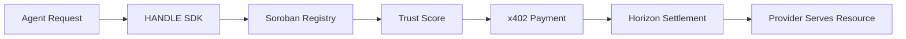

# HANDLE

> Discovery and reputation layer for agent-to-agent payments on Stellar.

<p align="center">
  <strong>x402 · Stellar · Soroban · Trust Score</strong>
</p>

<p align="center">
  
  
  
</p>

---

## What is HANDLE?

HANDLE is a discovery and trust layer for agentic payments on Stellar. It enables autonomous agents to find, evaluate, and pay x402 API providers on Stellar — all in one SDK call.

HANDLE solves three problems that currently block agentic payments on Stellar:

- **Discovery** — agents calling x402 APIs have no reliable way to discover registered providers, their pricing, or whether they can be trusted.
- **Trust** — payment success is not the same as reliability; there is no auditable signal for provider quality.
- **Integration** — every agent team rebuilds the same Stellar payment flow (discover → challenge → sign → submit → retry) from scratch.

HANDLE provides a Soroban on-chain registry, a deterministic Trust Score, and an SDK that handles the full x402 flow with native USDC on Stellar.

---

## Architecture

```
┌──────────────────────────────────────────────────────────────┐
│                   Autonomous Agents                          │
│             (LLMs, bots, workflows)                          │
└──────────────────────┬───────────────────────────────────────┘
                       │  @flovia/agent-sdk
                       ▼
┌──────────────────────────────────────────────────────────────┐
│              HANDLE — Discovery & Trust Layer                │
│                                                              │
│  ┌─────────────┐ ┌──────────────┐ ┌──────────────────────┐  │
│  │  Soroban    │ │ Trust Score  │ │  x402-Stellar        │  │
│  │  Registry   │ │ (deterministic│ │  Challenge/Sign/     │  │
│  │  (on-chain) │ │  auditable)  │ │  Submit/Retry        │  │
│  └─────────────┘ └──────────────┘ └──────────────────────┘  │
└──────────────────────┬───────────────────────────────────────┘
                       │
         ┌─────────────┼─────────────┐
         ▼             ▼             ▼
   ┌──────────┐ ┌────────────┐ ┌────────────┐
   │ Horizon  │ │ Soroban RPC│ │ Native USDC│
   │ (REST)   │ │ (JSON-RPC) │ │ (Stellar)  │
   └──────────┘ └────────────┘ └────────────┘
```

### Repository structure

| Workspace | Purpose |
| --- | --- |
| `apps/cli/` | CLI entrypoint for market snapshot, customer intelligence, fixture capture, and reporting |
| `apps/bff/` | Read-only BFF API serving prepared fixtures and projections for the frontend |
| `apps/frontend/` | Next.js 15 + React 19 UI for provider catalog, customer intelligence, and co-usage |
| `apps/demo-provider/` | Demo x402 provider using `@flovia/x402-stellar` middleware |
| `packages/contracts/` | Shared Zod contracts, TypeScript types, and normalization helpers |
| `packages/sources/` | Source clients and normalization for on-chain data |
| `packages/intelligence/` | Join logic, ranking, Trust Score, customer intelligence, and projection helpers |

### Core flow



---

## Quick start

### Requirements

- Bun `>=1.3.13`
- Node.js `>=20` (for the frontend)

### Install and verify

```sh
bun install
cp -n .env.example .env
bun run verify
```

### Start the demo stack

```sh
bun --filter bff start       # BFF API (default: localhost:3001)
bun --filter frontend dev    # Frontend (default: localhost:3000)
```

Or with Docker Compose:

```sh
docker compose up --build
```

### Common commands

Unless otherwise noted, run from the repository root.

```sh
bun run verify        # import boundary, typecheck, tests, offline verification
bun run test          # test suite
bun run typecheck     # TypeScript strict typecheck
bun run format        # format TypeScript / JSON with Biome
bun run format:check  # check formatting
```

---

## Trust Score

The Trust Score is a deterministic, auditable 0–100 score calculated from on-chain data. It is not an ML model — every score is fully explainable.

```
TrustScore = w1·age + w2·volume + w3·kyb + w4·claims + w5·recency

age      = min(1, days_since_registered / 90)       weight: 0.15
volume   = min(1, log10(usdc_volume_30d + 1) / 4)   weight: 0.30
kyb      = 1.0 if verified, 0.3 if pending, 0 if not weight: 0.30
claims   = 1 - min(1, disputes / payments)            weight: 0.15
recency  = 1.0 if active in 7d, 0.5 if 30d, 0 else   weight: 0.10
```

---

## Stellar architecture

HANDLE is 100% Stellar-native. There is no EVM, no Solana, and no multi-chain support.

| Component | Detail |
| --- | --- |
| **Network** | Stellar testnet (mainnet planned post-hackathon) |
| **Smart contracts** | Soroban (Rust) |
| **Payment asset** | Native USDC on Stellar |
| **SDK** | `@stellar/stellar-sdk` (TS) + `soroban-sdk` (Rust) |
| **Runtime** | Bun |
| **Frontend** | Next.js 15 App Router, React 19, Tailwind CSS v4 |

---

## x402 payment flow

HANDLE implements x402 over Stellar with native USDC:

```
1. Agent: GET https://provider.com/data
2. Provider middleware: no X-PAYMENT header
   → responds 402 with challenge (destination, amount, asset, memo, expiry)
3. Agent (via SDK): builds payment operation, signs with Stellar secret
4. Agent: submits to Horizon
5. Horizon: confirms transaction (~5s finality)
6. Agent: GET https://provider.com/data
   Header: X-PAYMENT: <tx_hash>
7. Middleware: verifies tx via Horizon (destination, asset, amount, memo, idempotency)
8. Middleware: serves the resource
```

---

## Security and trust caveats

- **Testnet only** — this is a hackathon submission; all deployments target Stellar testnet.
- **Demo data** — the BFF serves prepared fixtures and projections; it does not call live RPC on the request path.
- **Deterministic Trust Score** — scores are computed from on-chain data with a documented formula; no black-box ML.
- **No private keys in code** — use `.env` with `.env.example` as a template.
- **Soroban registry is on-chain** — provider registration and payment logs are verifiable on the Stellar testnet explorer.

---

## License

MIT

---

*HANDLE — built for the Stellar Community Fund hackathon, 100% testnet.*
